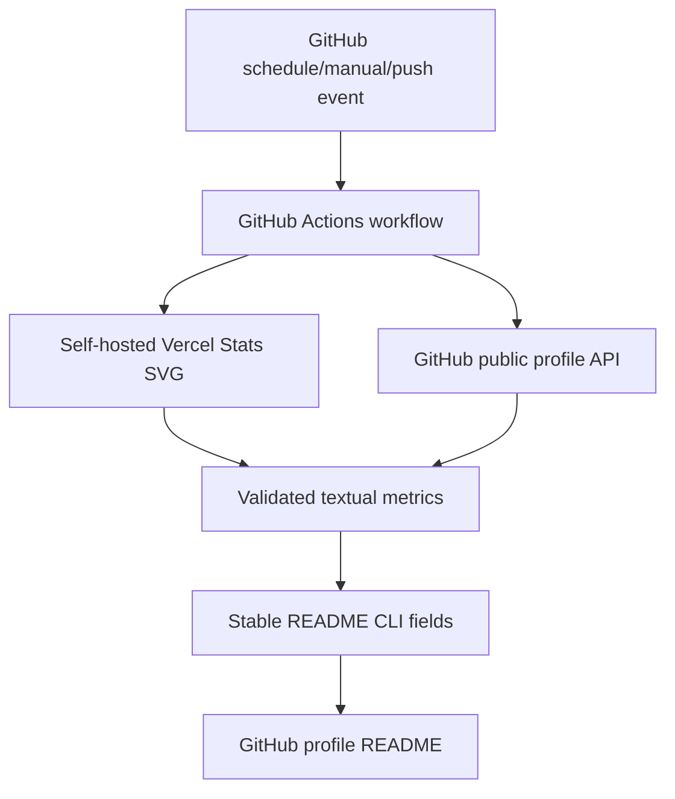

# Root Data Flow

This repository renders a GitHub profile README as a static neofetch-style terminal panel with scheduled textual metric refreshes.

External dependencies:

- `github-readme-stats-8c11-kangseokjoos-projects.vercel.app`: self-hosted GitHub Readme Stats deployment, used only to extract commit/PR/contribution counters.
- `api.github.com/users/Candy-Tree`: public GitHub API endpoint used to obtain repository and social counters.
- `secrets.GITHUB_TOKEN`: GitHub Actions token used only for the README commit.
